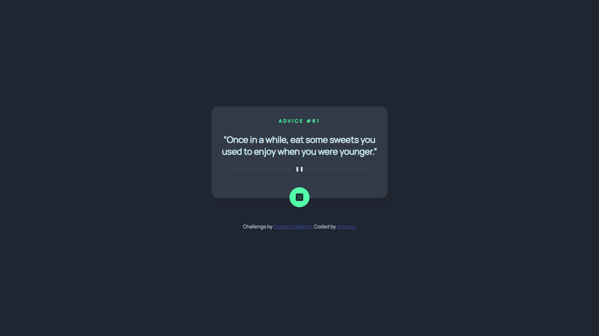

# Frontend Mentor - Advice generator app solution

This is my solution to the [Advice generator app challenge on Frontend Mentor](https://www.frontendmentor.io/challenges/advice-generator-app-QdUG-13db).

# Overview

[Live Site](https://purpleboxe.github.io/Advice-generator-app/)

## Preview

## The process

### Built with

- HTML5
- CSS
- Flexbox
- JS

### What I learned

In this project I learned how to call from an api using fetch.
I'm quite proud of myself for figuring that out and also for laying out the website with flex.

## Conclusion

In all this project was simple, but still took me some work to do.
I'm glad I could get something out of this project.